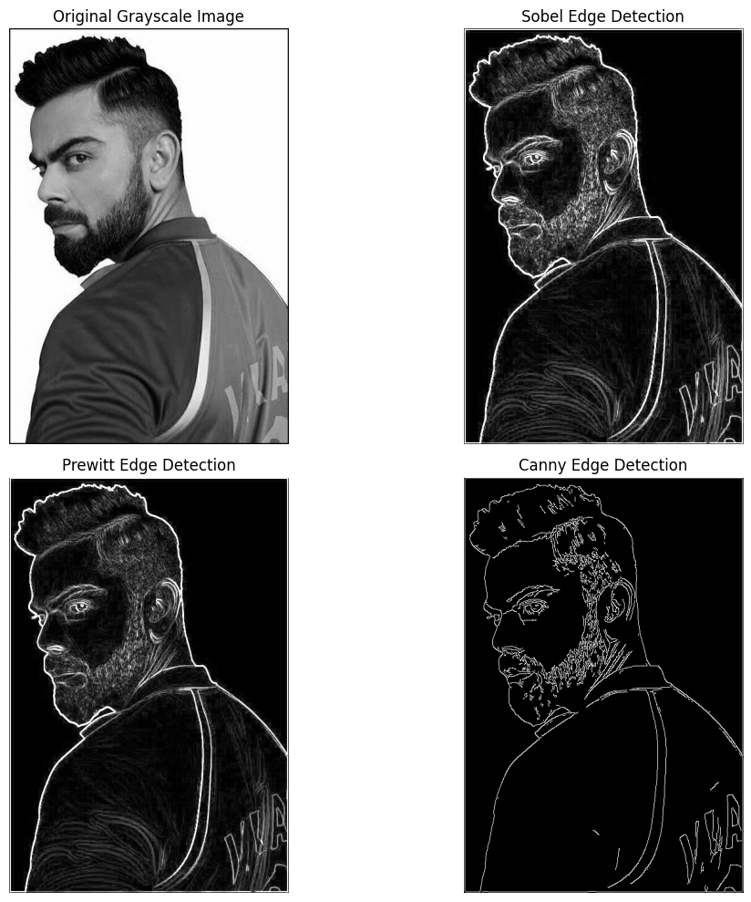

# Edge Detection Using Sobel, Prewitt and Canny

## Aim

To detect and compare the edges present in a grayscale image using
**Sobel, Prewitt, and Canny edge detection techniques** in Computer
Vision.

## Output

The output shows the original grayscale image along with the
edge-detected results obtained using Sobel, Prewitt, and Canny methods.

### Output Image

## Result

The edges of the input image were successfully detected using Sobel,
Prewitt, and Canny edge detection techniques. The results can be
visually compared with the original grayscale image.
